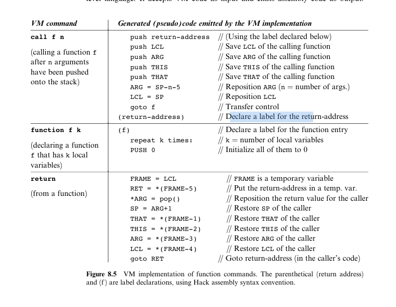
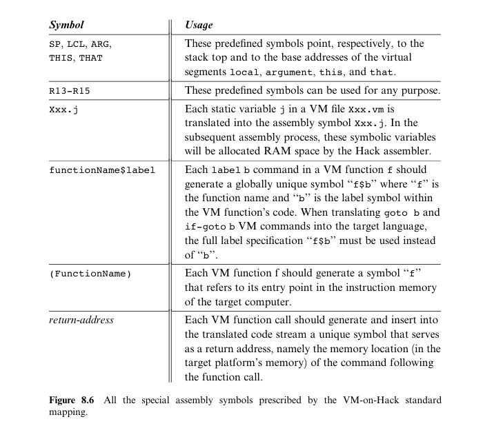
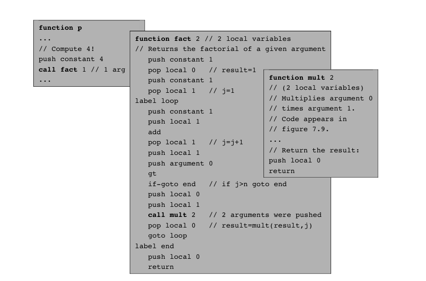
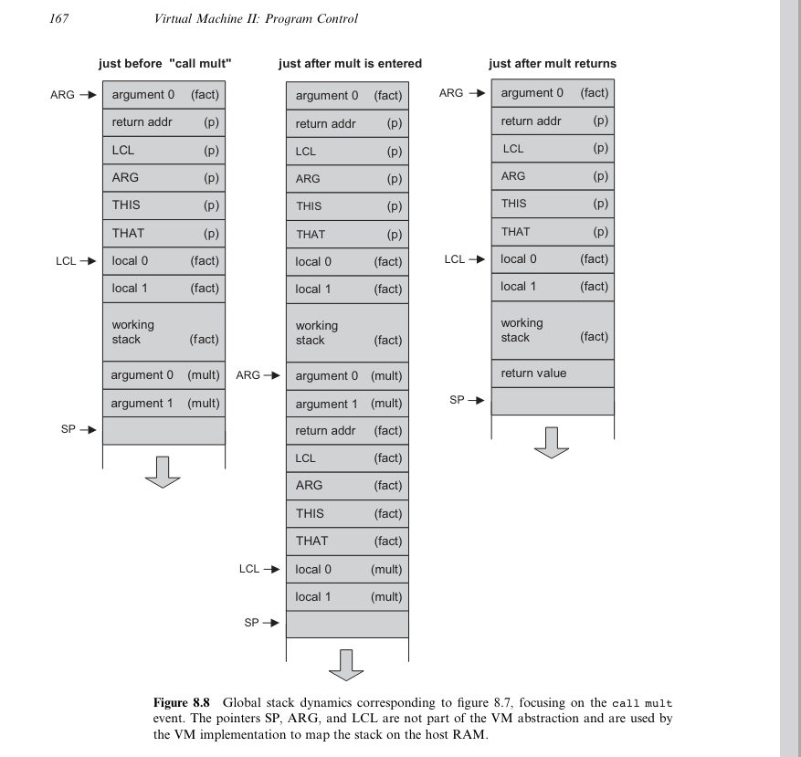

# Description

- Useful information about chapter_8
- Basically the idea is the following
- VM-translator needs to translate .vm to .asm
- So for the resting keywords
    - call
    - return
    - function
- What will be done is create a function, for
  codewritter that follows the provides pseudocode
  in such a way each keyword will execute
  a serie of instruction that will use the global stack
  memory in such a way that the thinking process
  of the call and return make of a function will be
  sucesfull

## Images
- 
- 
- 
- 

